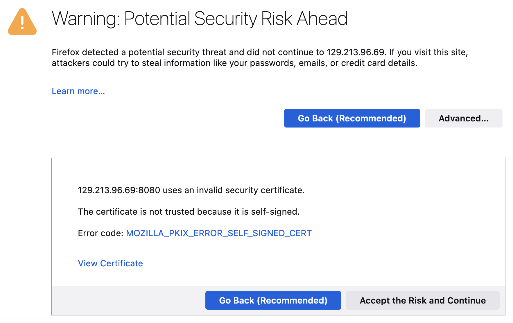
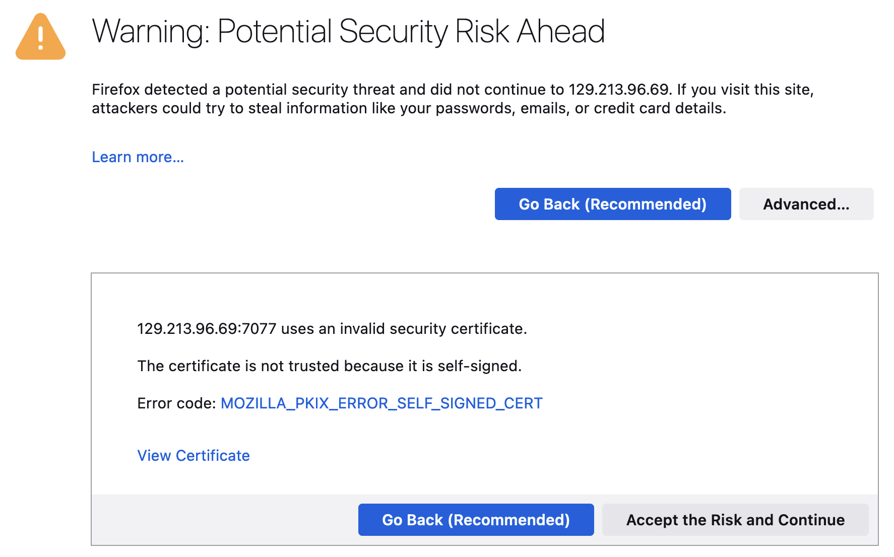

# Connect to JDE Trial Edition

## Introduction

JD Edwards (JDE) Trial Edition is now running and ready for use. In this tutorial, you will learn how to utilize it.

Estimated Time: 10 minutes

### About Product/Technology

JDE Trial Edition is up and running and ready to be used but the user needs to know how to connect to it and leverage the system.  

### Objectives

In this tutorial, you will:
* Connect to EnterpriseOne HTML Server.
*	Connect to EnterpriseOne AIS Client.
*	Connect to EnterpriseOne Orchestrator Studio.
*	Connect to Oracle BI Publisher.
*	Learn where additional resources are located.

### Prerequisites

*   JDE Trial Edition Provisioned.
*   JDE Trial Edition Configured.

## Task 1: Connect to EnterpriseOne HTML Server

The HTML Server is the primary interface to the EnterpriseOne system.  

1.	To access the EnterpriseOne HTML server, open a supported browser from any workstation connected to the internet. (Firefox is recommended)

    **Note:** If this is the first connection to any of the following URLs from the workstation or browser type, it will prompt you to confirm secure connection. This is due to JDE Trial Edition using a temporary SSL Certificate for security. These web addresses are totally safe so you need not worry.

2.  Using the public IP address for the instance and port number (Create a Trial Edition Instance in Oracle Cloud Infrastructure, Step 3) assigned to the HTML server as part of the final configuration and security list, enter the following URL into the browser:

        https://"ip address:port"/jde/owhtml/index.html

    For example,

        https://129.146.104.179:8080/jde/owhtml/index.html

3.  Click **Advanced** and then **Accept the Risk and Continue** to confirm that the connection is trusted.

    **Note:**
     * Message and Security differ from browser to browser. This example is from a Mozilla Firefox browser.
     * If this JDE Trial Edition is for long-term usage, it is recommended that you replace the temporary SSL Certificate with a real SSL Certificate.

        

4.	In the JD Edwards EnterpriseOne HTML Server sign-on page, sign in using these credentials:

    *   User ID: **JDE**
    *	Password: **JDE_Rules1** (this is the password defined in the final configuration in Create a Trial Edition Instance in Oracle Cloud Infrastructure, Step 3)

        

    At this point, the JD Edwards EnterpriseOne HTML Client is ready for use.

     

## Task 2: Connect to EnterpriseOne Orchestrator Studio

The EnterpriseOne Orchestrator Studio is an interface to help create orchestrations.

1.  To access the Orchestrator Studio, open a supported browser from any workstation connected to the internet.

2.	Using the public IP address for the instance and port number 7077, which is automatically assigned to the Orchestrator Studio and is part of the security list, enter the following URL into the browser:

        https://<ip_address>:7077/studio/studio.html

    For example,

        https://129.213.43.190:7077/studio/studio.html

    **Note:** If this is the first connection to this URL from the workstation or browser type, it will prompt you to confirm secure connection. This is due to JDE Trial Edition using a temporary SSL Certificate for security.

3.	Click **Advanced** and then **Accept the Risk and Continue** to confirm that the connection is trusted.

    **Note:**
     * Message and Security differ from browser to browser. This example is from a Mozilla Firefox browser.
     * If this Trial Edition is for long-term usage, it is recommended that you replace the temporary SSL Certificate with a real SSL Certificate.

       

4.	In the JD Edwards EnterpriseOne Orchestrator Studio sign-on page, sign in using these credentials:

    *	User name: **JDE**
    *	Password: **JDE_Rules1** (this is the password defined in the final configuration in Create a Trial Edition Instance in Oracle Cloud Infrastructure, Step 3).

    

    At this point, the JD Edwards EnterpriseOne Orchestrator Studio is ready for use.

    

## Task 3: Explore JDE Service Commands
After you have successfully deployed your JDE Trial Edition instance in the Oracle Cloud Infrastructure (OCI), all services are automatically started for each JD Edwards EnterpriseOne server type, which includes the database server, enterprise server, HTML web servers, BI publisher server and AIS server.

After the initial startup, all these services can be manually started and stopped by the root user. The JDE Trial Edition is equipped with command line features for easy status checking and start and stop capabilities. This tutorial will walk you through running these commands to find status and start and stop services.

1.	To use the JDE service commands, using the SSH key, open a command line session to the JDE trial edition instance.

2.	Change to root user.

        [opc]#  sudo –i

    

3.	First run the JDE-status command. That will probe all the essential pieces running on the JDE Trial Edition (database, enterprise server, web servers, BI publisher server) and report on the status of the piece. Any service reporting anything but “Running” might have a problem.

        [root]#  jde-status

    

4.	Below are the services broken down by piece. Issue the following commands to review the specific services:

    * Database: **jde-db status**

        

    * Enterprise Server: **jde-ent status**

        

    * Web Server: **jde-html status**

        

    * BIP Server: **jde-bip status**

        

5.	To stop a particular service, issue the following commands:

    * Database: **jde-db stop**

    * Enterprise Server: **jde-ent stop**

    * Web Server: **jde-html stop**

    * BIP Server: **jde-bip stop**

6.	To start a particular service, issue the following commands:

    * Database: **jde-db start**

    * Enterprise Server: **jde-ent start**

    * Web Server: **jde-html start**

    * BIP Server: **jde-bip start**

## Task 4:  Connect to Oracle BI Publisher Server for OVR

The Oracle BI Publisher Server for One View Reporting (OVR) is a reporting tool.

1.	To access the Oracle BI Publisher Server, open a supported browser from any workstation connected to the internet.

2.	Using the public IP address for the instance and port number 9705, which is automatically assigned to the BI Publisher and is part of the security list, enter the following URL into the browser:

        https://<ip address>:9705/xmlpserver

    For example,

        https://132.145.187.16:9705/xmlpserver

    **Note:** If this is the first connection to this URL from the workstation or browser type, it will prompt you to confirm secure connection. This is due to JDE Trial Edition using a temporary SSL Certificate for security.

3.	Click **Advanced** and then **Accept the Risk and Continue** to confirm that the connection is trusted.

    **Note:**
     * Message and Security differ from browser to browser. This example is from a Mozilla Firefox browser.
     * If this Trial Edition is for long-term usage, it is recommended that you replace the temporary SSL Certificate with a real SSL Certificate.

        

4.	In the Oracle BI Publisher sign-on page, sign in using these credentials:
    *	User name: **weblogic**
    *	Password: **JDE_Rules1** (this is the password defined in the final configuration in Create a Trial Edition Instance in Oracle Cloud Infrastructure, Step 3)

        

    At this point, the Oracle BI Publisher Server for OVR is ready for use.

    

## Task 5:  Learn Where Additional Resources are Located

For additional information, refer to these resources:

 *	[JDE Learning Path](https://apexapps.oracle.com/pls/apex/f?p=44785:50:0:::50:P50_EVENT_ID,P50_COURSE_ID:6152,395)

 *   [General Learning Paths](https://apexapps.oracle.com/pls/apex/f?p=44785:50:102950731364668:::::)

 *	[Marketplace Listing](https://console.us-ashburn-1.oraclecloud.com/marketplace/application/51184836/overview)

## Summary
Your environment is now fully functional and ready to go. Enjoy JDE on OCI!  

## Acknowledgements
* **Author:** Tarani Meher, Principal JDE Specialist
* **Contributors:**
    * Jeff Kalowes, Principal JDE Specialist
    * Tarani Meher, Principal JDE Specialist
* **Last Updated By/Date:** Tarani Meher, Principal JDE Specialist, 03/2023
